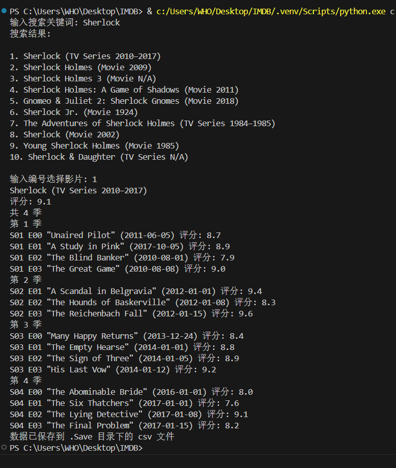

# 项目介绍

一个用于爬取剧集 IMDB 评分和 Trakt.tv 评分的 Python 爬虫.
只需输入剧集名称，就可以爬取剧集每一集的基本信息, IMDB 评分和 Trakt 评分.
数据会保存到本地 csv 文件中, 便于后续用 Excel 处理.


## Usage 使用方法

1.安装 Python:

项目的原始开发环境是 Python 3.12.2.
所以建议安装接近 Python 3.12.2 的版本.

2.安装依赖:
```bash
pip install -r requirements.txt
```

3.运行项目:
```bash
python src/imdb.py
```
或者
```bash
python src/trakt.py
```
生成的 csv 文件在 .save 目录下.

## 运行效果



## 注意事项

1. 请确保你的网络环境可以访问 IMDb 和 Trakt 网站.
2. 爬取过程中会在 .cache 目录下生成缓存文件.

    遇到和之前相同的输入, 会先从缓存文件中提取数据.
    如需爬取最新数据, 需先删除缓存文件.
